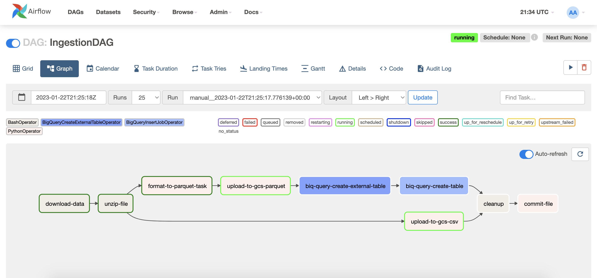

## Data Engineering LokaCamp Project
Author: Stefan Kochev

From source to dashboards - USA flights data insights (1987 to 2008).

The goal of the project is ingestion and analysis of a large dataset for flight delays
data in the USA. We will try to answer some questions:
- What is the best time of the year to fly to minimise delays?
- Do older planes suffer more delays?
- How does increased air-traffic impact on-time schedules?
- Are there any flight delay patterns? etc.

### Datasource
We will ingest, process the data and serve data insights for the "Airline on-time performance" dataset:

"Have you ever been stuck in an airport because your flight was
delayed or cancelled and wondered if you could have predicted it if you'd had more data? This
is your chance to find out. The data: The data consists of flight arrival and departure details
for all commercial flights within the USA, from October 1987 to April 2008. This is a large
dataset: there are nearly 120 million records in total, and takes up 1.6 gigabytes of space
compressed and 12 gigabytes when uncompressed. The data comes originally from RITA where it is
described in detail."

Source:

https://dataverse.harvard.edu/dataset.xhtml?persistentId=doi:10.7910/DVN/HG7NV7

https://community.amstat.org/jointscsg-section/dataexpo/dataexpo2009

Airports data - the flight entries in the dataset contain airport codes only, without any airport info.
To provide more details to analysts, we will extend each flight record with airport details from 
https://github.com/datasets/airport-codes 
(the csv https://github.com/datasets/airport-codes/blob/master/data/airport-codes.csv)


### Cloud Resources
We will be using GCP resources to host datalake and BigQuery as a Data Warehouse.
The resources are deployed with Terraform. For more details, follow the instructions
in the [terraform_gcp](./terraform_gcp) directory README.

Once we have the resources deployed, we can proceed with the ingestion pipeline.

### Ingestion Pipeline
Airflow is used as workflow orchestrator. We can run the airflow instance locally with
docker-compose. 

1. Update the variables in the [./airflow/.env.gcp](./airflow/.env.gcp) file appropriately.
2. Create a GCP service account and download the JSON credentials file. The service account should have full
   GCS and full BigQuery access.
3. Store the file as `~/.config/gcloud/google_credentials.json`
4. Run:
   ```shell
   cd airflow
   docker-compose up -d
   ```

Now open the airflow web UI on http://localhost:8080/

- username: airflow
- password: airflow

Use the tags filter to find the 2 Airflow DAGs we need - tag `zoom-camp`. Now we can see the two DAGs:

- IngestionTriggerDAG - ingestion controller DAG, reads the source_files.csv metadata file and triggers the
main IngestionDag per file
- IngestionDAG - downloads, processes, uploads the files to GCS datalake, ingests the data in BigQuery and creates
BigQuery tables. The final step commits the file - marks the file as ingested.
  
#### Ingestion Trigger DAG


On the right side, under `Mapped Instances`, we can see the triggered Ingestion DAG instances for each file.

The first step of the DAG reads the file from the `GCS_BUCKET/metadata/source_files.csv` and compares the entries
with the commit log file `GCS_BUCKET/metadata/source_files_commit_log.csv`. If there were new entries detected in the
`GCS_BUCKET/metadata/source_files.csv` file, then for each new entry an IngestionDAG run is triggered.

The IngestionTriggerDAG is scheduled to run once every day.

#### Ingestion DAG



The Ingestion DAG consists of 9 steps. First, we download the data from the source URL. The original file format
is a compressed CSV as a bzip file, so the second step unzips the file. Then, we upload the CSV to GCS
to keep the original file format and, in parallel, we convert the file to .parquet file format and upload this file 
too. The .parquet path of the DAG is responsible for creating the BigQuery tables (external GCS + internal). The 
final two steps will cleanup the local files to free up some worker storage resources and finally commit the file, 
i.e. mark the file as ingested (updates the `GCS_BUCKET/metadata/source_files_commit_log.csv` with the ingested file).

The BigQuery table created as part of this ingestion pipeline is not partitioned nor clustered. We keep these 
modifications for the analytical modeling part of the project.

### Data Analytics
We use dbt to create and deploy the analytical views and models for the data. For more details, 
follow the instructions in the [dbt_airlines](./dbt_airlines) directory README.

### Dashboards
Looker Studio is used to create the dashboards. Below we have some screenshots from the Looker Studio report.

#### Overview


#### Traffic Intensity vs Delays


#### Cancelled and Diverted Flights over years


#### Diverted flights patterns

